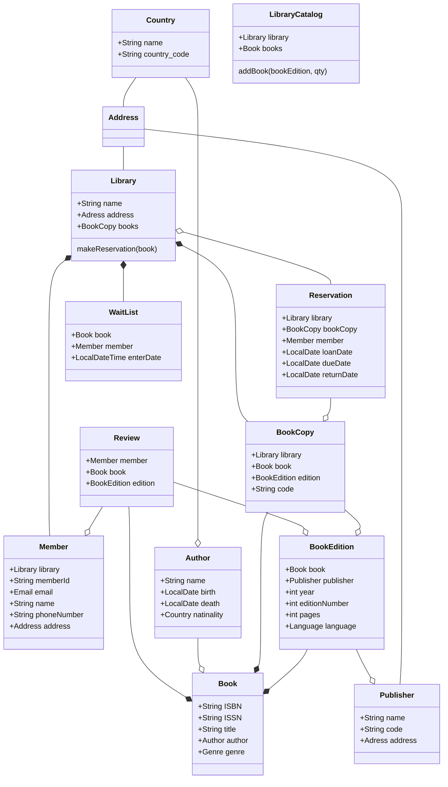

```mermaid

classDiagram
direction TB

Library *-- Member
Review --o Member
Review --o BookEdition
Review --* Book
Country -- Address
Country --o Author
Address -- Library
Author --o Book
Library *-- BookCopy
Library o-- Reservation
Library *-- WaitList
Reservation --o BookCopy
BookCopy --* Book
BookCopy --o BookEdition
BookEdition --* Book
BookEdition --o Publisher
Address -- Publisher

class Library {
    +String name
    +Adress address
    +BookCopy books
    makeReservation(book)
}
class Country {
    +String name
    +String country_code
}
class Author {
    +String name
    +LocalDate birth
    +LocalDate death
    +Country natinality
}
class Publisher {
    +String name
    +String code
    +Adress address
}
class BookCopy {
    +Library library
    +Book book
    +BookEdition edition
    +String code
}
class BookEdition {
    +Book book
    +Publisher publisher
    +int year
    +int editionNumber
    +int pages
    +Language language
}
class Book {
    +String ISBN
    +String ISSN
    +String title
    +Author author
    +Genre genre
}
class LibraryCatalog {
    +Library library
    +Book books
    addBook(bookEdition, qty)
}
class Reservation {
    +Library library
    +BookCopy bookCopy
    +Member member
    +LocalDate loanDate
    +LocalDate dueDate
    +LocalDate returnDate
}
class WaitList {
    +Book book
    +Member member
    +LocalDateTime enterDate
}

class Member {
    +Library library
    +String memberId
    +Email email
    +String name
    +String phoneNumber
    +Address address
}
class Review {
    +Member member
    +Book book
    +BookEdition edition
}
```
