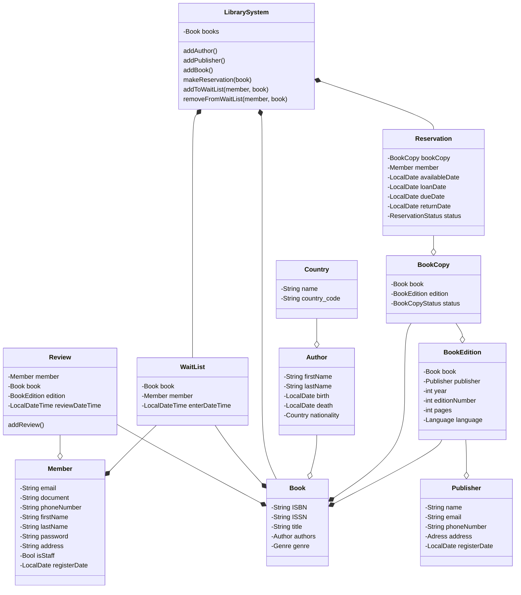

```mermaid

classDiagram
direction TB

Review --o Member
Review --* Book

LibrarySystem *-- WaitList
WaitList --* Member
WaitList --* Book

LibrarySystem *-- Book
Country --o Author
Author --o Book

LibrarySystem *-- Reservation
Reservation --o BookCopy
BookCopy --* Book
BookEdition --* Book
BookCopy --o BookEdition
BookEdition --o Publisher


class Country {
    -String name
    -String country_code
}
class Author {
    -String firstName
    -String lastName
    -LocalDate birth
    -LocalDate death
    -Country nationality
}
class Publisher {
    -String name
    -String email
    -String phoneNumber
    -Adress address
    -LocalDate registerDate
}
class BookCopy {
    -Book book
    -BookEdition edition
    -BookCopyStatus status
}
class BookEdition {
    -Book book
    -Publisher publisher
    -int year
    -int editionNumber
    -int pages
    -Language language
}
class Book {
    -String ISBN
    -String ISSN
    -String title
    -Author authors
    -Genre genre
}

class Member {
    -String email
    -String document
    -String phoneNumber
    -String firstName
    -String lastName
    -String password
    -String address
    -Bool isStaff
    -LocalDate registerDate
}

class LibrarySystem {
    -Book books
    addAuthor()
    addPublisher()
    addBook()
    makeReservation(book)
    addToWaitList(member, book)
    removeFromWaitList(member, book)
}
class Reservation {
    -BookCopy bookCopy
    -Member member
    -LocalDate availableDate
    -LocalDate loanDate
    -LocalDate dueDate
    -LocalDate returnDate
    -ReservationStatus status
}
class Review {
    -Member member
    -Book book
    -BookEdition edition
    -LocalDateTime reviewDateTime
    addReview()
}
class WaitList {
    -Book book
    -Member member
    -LocalDateTime enterDateTime
}


```
