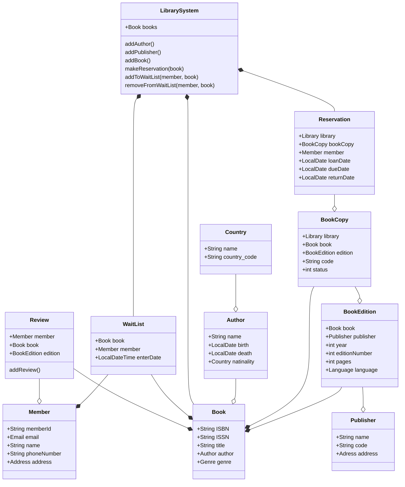

```mermaid

classDiagram
direction TB

Review --o Member
Review --* Book

LibrarySystem *-- WaitList
WaitList --* Member
WaitList --* Book

LibrarySystem *-- Book
Country --o Author
Author --o Book

LibrarySystem *-- Reservation
Reservation --o BookCopy
BookCopy --* Book
BookEdition --* Book
BookCopy --o BookEdition
BookEdition --o Publisher


class Country {
    +String name
    +String country_code
}
class Author {
    +String name
    +LocalDate birth
    +LocalDate death
    +Country natinality
}
class Publisher {
    +String name
    +String code
    +Adress address
}
class BookCopy {
    +Library library
    +Book book
    +BookEdition edition
    +String code
    +int status
}
class BookEdition {
    +Book book
    +Publisher publisher
    +int year
    +int editionNumber
    +int pages
    +Language language
}
class Book {
    +String ISBN
    +String ISSN
    +String title
    +Author author
    +Genre genre
}

class Member {
    +String memberId
    +Email email
    +String name
    +String phoneNumber
    +Address address
}

class LibrarySystem {
    +Book books
    addAuthor()
    addPublisher()
    addBook()
    makeReservation(book)
    addToWaitList(member, book)
    removeFromWaitList(member, book)
}
class Reservation {
    +Library library
    +BookCopy bookCopy
    +Member member
    +LocalDate loanDate
    +LocalDate dueDate
    +LocalDate returnDate
}
class Review {
    +Member member
    +Book book
    +BookEdition edition
    addReview()
}
class WaitList {
    +Book book
    +Member member
    +LocalDateTime enterDate
}


```
